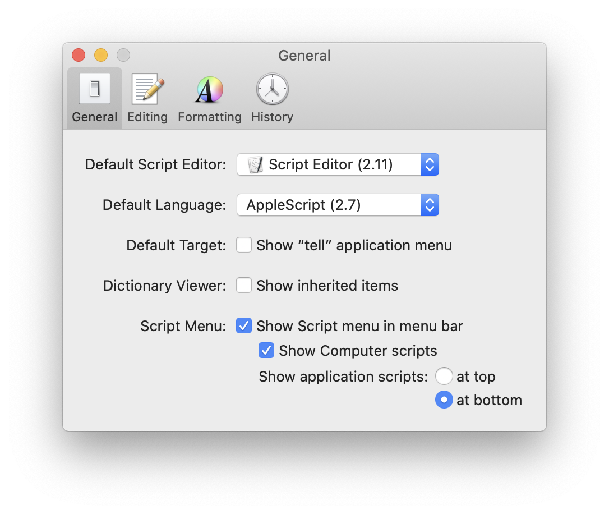
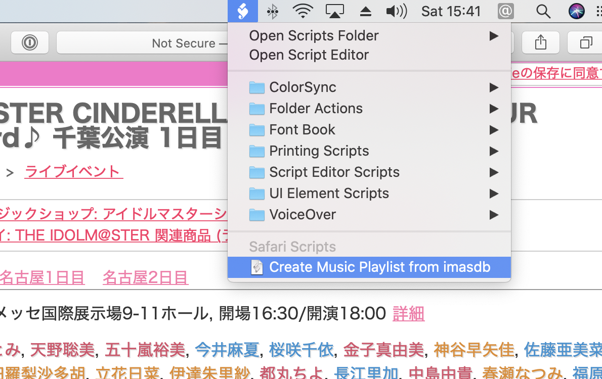
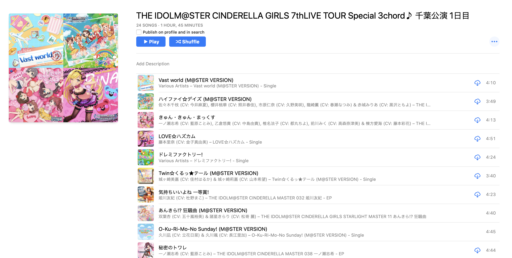

# 🎤Create Music Playlist from imasdb
Create Music's playlist from [imasdb](https://imas-db.jp)'s setlist.

## How to setup
### 1. Enable script menu
Enable "Show Script menu in menu bar" from Script editor Preferences.



### 2. Install AppleScript
Copy this script into Safari's script folder:

```sh
cp ./*.scpt ~/Library/Scripts/Applications/Safari/
```

### 3. Create Playlist
Go to your favorited event page (e.g. http://imas-db.jp/song/event/cinderella7th0903.html), and run this script from menu.



### 4. Enjoy
Enjoy songs at Music.app.



